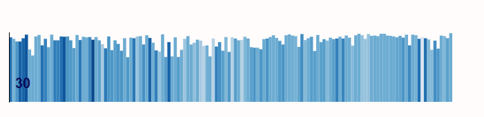
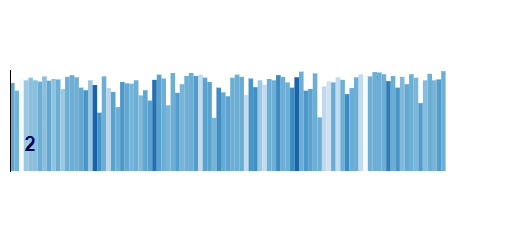

# Jane Eyre visualisation

This project is available [here](https://sorchawalsh.github.io/jane_eyre_visualisation/)
## Data
The raw data for this project was obtained from the Gutenberg project. It was then processed using Python. The main modules I used included TextBlob (a natural language processing utility) and re, the regular expression module for Python. CSV was also used to write the final file.

Firstly, the book was segmented into chapters, sentences, and words. For these tasks, I used a series of regular expressions. These weren't flawless, however using TextBlob's segmentation utilities did not obtain a better result and was slower. This was the basis for the shape of the graph, with each individual graph representing a chapter, each line a sentence, and its length the number of words in said sentence.

The colour of the lines, as well as the information in the tooltip, was obtained using TextBlob to perform a sentiment analysis. While sentiment analysis is not necessarily a very accurate tool, it can nonetheless give interesting results as we see here.

A key shortcoming of TextBlob's sentiment analysis is the fact that it gives a sentiment score to each word in a segment and then averages it to get the overall score. This leads to certain sentences being more positive than they should be, owing to the weight of negation ending up being slightly low when averaged over long sentences.

Another issue with TextBlob is that it was not necessarily designed for a Victorian writing style: in passages which feature dialogue (and these are numerous in this book), Charlotte Brontë often forgoes punctuation at the end of a sentence. This means that TextBlob does not detect the end of said sentence, leading to fewer sentences which are longer than they should be. However, Brontë's writing style tends towards long sentences in general, with one sentence often taking up an entire paragraph, so these instances do not particularly stand out.

## Visualisation
I then used the processed data to create an analysis with three "dimensions": sentences per chapter (x axis), words per sentence (y axis), and sentiment of the sentence (colour). The visualisation of the sentiment analysis shows an overall neutral sentiment, but allows one to clearly see the moments of high emotion. An issue which I was unable to resolve is that certain text bars appear outside the bounds of the graph.

Certain key moments in the narrative can be visualised through this sentiment analysis. For example:

At the beginning of this chapter, Jane Eyre is at Moor House, a generally happy place for her, spending time with people who are kind to her and with whom she has pleasant conversations.

However, at the begining of the second chapter, she is in the Red Room, a haunted room in the first place she lives, as a punishment. The relative lightness of the colours clearly shows the difference in mood between these two episodes.

_This project was produced in the context of the_ Visualisation de données _class, given by Isaac Pante in Spring 2021 at UNIL._
